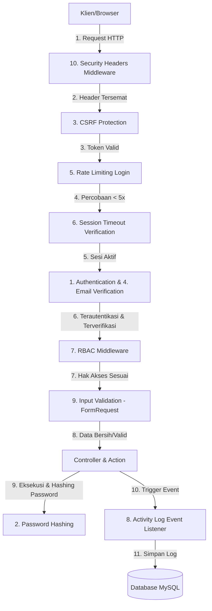

# Implementasi dan Pentesting Kontrol Keamanan OWASP ASVS Level 1
## (Laravel Breeze Security Implementation & Burp Suite Pentesting Guide)

Dokumen ini berisi panduan komprehensif mengenai pemilihan kontrol keamanan berbasis **OWASP ASVS v4.0.3 (Level 1)**, cara implementasinya di Laravel, metode pengujian mandiri, skenario penetration testing menggunakan Burp Suite, serta outline presentasi untuk tugas Keamanan Sistem Informasi.

---

## Request Lifecycle dengan 10 Kontrol Keamanan

Mermaid diagram di bawah ini mengilustrasikan bagaimana setiap kontrol keamanan yang diimplementasikan menyaring dan memproses request dari klien hingga ke database log.



---

## 1. Daftar Kontrol OWASP ASVS v4.0.3 yang Dipilih (Level 1)

Berikut adalah 10 kontrol keamanan yang paling relevan untuk aplikasi Laravel Breeze Anda, dipetakan ke nomor kontrol OWASP ASVS v4.0.3 Level 1:

| No | Kontrol Keamanan | Kode ASVS | Deskripsi Kontrol ASVS Level 1 |
| -- | ---------------- | --------- | ------------------------------ |
| **1** | **Authentication** | **V2.1.1** | Memastikan panjang minimal password pengguna adalah 8 karakter (ASVS menyarankan 12, namun minimal 8 untuk Level 1). |
| | | **V2.1.7** | Memastikan password dicek terhadap daftar password yang umum digunakan atau bocor (compromised). |
| **2** | **Password Hashing** | **V2.4.1** | Memastikan password disimpan menggunakan algoritma hashing satu arah yang kuat seperti bcrypt atau Argon2id. |
| **3** | **CSRF Protection** | **V4.2.1** | Memastikan aplikasi terlindung dari serangan Cross-Site Request Forgery (CSRF) menggunakan token kriptografi yang unik untuk setiap sesi. |
| **4** | **Email Verification** | **V2.10.1** | Memastikan pengguna baru melakukan verifikasi kepemilikan alamat email sebelum diizinkan mengakses fitur utama. |
| **5** | **Rate Limiting Login** | **V2.2.1** | Memastikan aplikasi membatasi jumlah kegagalan login untuk mencegah brute force dan credential stuffing. |
| **6** | **Session Timeout** | **V3.3.1** | Memastikan sesi pengguna otomatis dihancurkan (expired) setelah periode tidak aktif (idle timeout). |
| **7** | **RBAC (Role-Based Access Control)** | **V4.1.1** | Memastikan otorisasi hak akses dikontrol di server berdasarkan peran (role) pengguna. |
| **8** | **Activity Log** | **V7.1.1** | Memastikan semua aktivitas penting yang berkaitan dengan keamanan (login sukses/gagal, registrasi, ubah password) dicatat dalam log audit. |
| **9** | **Input Validation** | **V5.1.1** | Memastikan seluruh input dari pengguna divalidasi menggunakan metode whitelist (pola, tipe data, panjang) di sisi server sebelum diproses. |
| **10** | **Security Headers** | **V14.4.1** | Memastikan aplikasi mengirimkan HTTP security headers (seperti CSP, X-Frame-Options, HSTS, dll.) untuk mitigasi serangan sisi klien. |

---

## 2. Cara Implementasi di Laravel

Berikut adalah detail kode dan konfigurasi untuk mengaktifkan seluruh kontrol keamanan di atas pada Laravel Breeze Anda.

### A. Kontrol 1, 2 & 9: Password Strength & Input Validation
Kita akan memodifikasi `app/Providers/AppServiceProvider.php` untuk mengonfigurasi aturan password default yang sangat kuat dan divalidasi dengan database kebocoran password (uncompromised).

```php
// app/Providers/AppServiceProvider.php
namespace App\Providers;

use Illuminate\Support\ServiceProvider;
use Illuminate\Validation\Rules\Password;

class AppServiceProvider extends ServiceProvider
{
    public function boot(): void
    {
        // Mendefinisikan aturan default password yang aman secara global
        Password::defaults(function () {
            return Password::min(8)
                ->letters()        // Wajib mengandung huruf
                ->mixedCase()      // Wajib ada huruf besar & kecil
                ->numbers()        // Wajib mengandung angka
                ->symbols()        // Wajib mengandung simbol (!, @, #, dll.)
                ->uncompromised(); // Mencegah password yang pernah bocor di internet
        });
    }
}
```
*Aturan ini akan otomatis diterapkan pada form pendaftaran `RegisteredUserController.php` dan perubahan password `PasswordController.php` karena keduanya memanggil `Password::defaults()`.*

### B. Kontrol 6: Session Timeout (Idle & Close)
Ubah file konfigurasi sesi pada `.env` untuk memperpendek masa aktif sesi tidak aktif dan menghapus sesi saat browser ditutup.

```env
# .env
SESSION_LIFETIME=15
SESSION_EXPIRE_ON_CLOSE=true
```

### C. Kontrol 7: Role-Based Access Control (RBAC)
Kita membuat sistem RBAC mandiri yang bersih menggunakan Enum, kolom baru di database, dan middleware custom.

#### 1. Buat Enum Peran Pengguna
```php
// app/Enums/Role.php
namespace App\Enums;

enum Role: string
{
    case ADMIN = 'admin';
    case USER = 'user';
}
```

#### 2. Migrasi Database (Tambah kolom `role`)
Buat migrasi untuk menambahkan kolom `role` ke tabel `users`.
```php
// database/migrations/xxxx_xx_xx_xxxxxx_add_role_column_to_users_table.php
use Illuminate\Database\Migrations\Migration;
use Illuminate\Database\Schema\Blueprint;
use Illuminate\Support\Facades\Schema;

return new class extends Migration {
    public function up(): void {
        Schema::table('users', function (Blueprint $table) {
            $table->string('role')->default('user')->after('password');
        });
    }

    public function down(): void {
        Schema::table('users', function (Blueprint $table) {
            $table->dropColumn('role');
        });
    }
};
```

#### 3. Hubungkan Enum ke Model `User`
```php
// app/Models/User.php
use App\Enums\Role;

protected function casts(): array
{
    return [
        'email_verified_at' => 'datetime',
        'password' => 'hashed', // KONTROL 2: Password Hashing otomatis
        'role' => Role::class,  // Cast ke Enum Role
    ];
}

public function isAdmin(): bool
{
    return $this->role === Role::ADMIN;
}
```

#### 4. Buat Middleware RBAC
```php
// app/Http/Middleware/RoleMiddleware.php
namespace App\Http\Middleware;

use Closure;
use Illuminate\Http\Request;
use Symfony\Component\HttpFoundation\Response;

class RoleMiddleware
{
    public function handle(Request $request, Closure $next, string $role): Response
    {
        if (! $request->user() || $request->user()->role->value !== $role) {
            abort(403, 'Akses ditolak. Anda tidak memiliki izin untuk halaman ini.');
        }

        return $next($request);
    }
}
```

#### 5. Daftarkan Middleware di `bootstrap/app.php`
```php
// bootstrap/app.php
->withMiddleware(function (Middleware $middleware): void {
    $middleware->alias([
        'role' => \App\Http\Middleware\RoleMiddleware::class,
    ]);
})
```

#### 6. Proteksi Rute Admin di `routes/web.php`
```php
// routes/web.php
use App\Http\Controllers\AdminController;

Route::middleware(['auth', 'verified', 'role:admin'])->group(function () {
    Route::get('/admin/dashboard', [AdminController::class, 'index'])->name('admin.dashboard');
    Route::post('/admin/users/{user}/role', [AdminController::class, 'updateRole'])->name('admin.users.update-role');
});
```

### D. Kontrol 8: Activity Log (Audit Trails)
Mencatat aktivitas penting yang sensitif terhadap keamanan secara otomatis dengan memanfaatkan event autentikasi Laravel.

#### 1. Migrasi Database untuk Tabel `activity_logs`
```php
// database/migrations/xxxx_xx_xx_xxxxxx_create_activity_logs_table.php
use Illuminate\Database\Migrations\Migration;
use Illuminate\Database\Schema\Blueprint;
use Illuminate\Support\Facades\Schema;

return new class extends Migration {
    public function up(): void {
        Schema::create('activity_logs', function (Blueprint $table) {
            $table->id();
            $table->foreignId('user_id')->nullable()->constrained('users')->nullOnDelete();
            $table->string('activity');
            $table->text('description')->nullable();
            $table->string('ip_address', 45)->nullable();
            $table->text('user_agent')->nullable();
            $table->json('properties')->nullable();
            $table->timestamp('created_at')->nullable();
        });
    }

    public function down(): void {
        Schema::dropIfExists('activity_logs');
    }
};
```

#### 2. Model `ActivityLog`
```php
// app/Models/ActivityLog.php
namespace App\Models;

use Illuminate\Database\Eloquent\Model;
use Illuminate\Database\Eloquent\Relations\BelongsTo;

class ActivityLog extends Model
{
    public $timestamps = false; // Hanya mencatat created_at
    protected $fillable = ['user_id', 'activity', 'description', 'ip_address', 'user_agent', 'properties', 'created_at'];
    protected $casts = ['properties' => 'array'];

    public function user(): BelongsTo {
        return $this->belongsTo(User::class);
    }
}
```

#### 3. Listener Keamanan `LogActivityListener`
```php
// app/Listeners/LogActivityListener.php
namespace App\Listeners;

use App\Models\ActivityLog;
use Illuminate\Support\Facades\Request;

class LogActivityListener
{
    public function handle(object $event): void
    {
        $activity = 'Unknown';
        $description = '';
        $userId = null;
        $properties = [];

        // Deteksi tipe event dari Laravel
        if ($event instanceof \Illuminate\Auth\Events\Login) {
            $activity = 'Auth - Login Success';
            $description = "User {$event->user->email} berhasil login.";
            $userId = $event->user->id;
        } elseif ($event instanceof \Illuminate\Auth\Events\Failed) {
            $activity = 'Auth - Login Failed';
            $description = "Gagal login menggunakan email: " . ($event->credentials['email'] ?? 'tidak diketahui');
            $properties = ['credentials_email' => $event->credentials['email'] ?? null];
        } elseif ($event instanceof \Illuminate\Auth\Events\Logout) {
            $activity = 'Auth - Logout';
            $description = "User {$event->user->email} berhasil logout.";
            $userId = $event->user->id;
        } elseif ($event instanceof \Illuminate\Auth\Events\Registered) {
            $activity = 'Auth - User Registered';
            $description = "User baru terdaftar: {$event->user->email}.";
            $userId = $event->user->id;
        } elseif ($event instanceof \Illuminate\Auth\Events\PasswordReset) {
            $activity = 'Auth - Password Reset';
            $description = "Password untuk user {$event->user->email} telah di-reset.";
            $userId = $event->user->id;
        }

        ActivityLog::create([
            'user_id' => $userId,
            'activity' => $activity,
            'description' => $description,
            'ip_address' => Request::ip(),
            'user_agent' => Request::userAgent(),
            'properties' => $properties,
            'created_at' => now(),
        ]);
    }
}
```

#### 4. Daftarkan Listener di `app/Providers/AppServiceProvider.php`
```php
// Tambahkan pada method boot() di app/Providers/AppServiceProvider.php
use Illuminate\Support\Facades\Event;

public function boot(): void
{
    // ... aturan password default ...

    // Mendaftarkan listener untuk event autentikasi
    Event::listen(
        [
            \Illuminate\Auth\Events\Login::class,
            \Illuminate\Auth\Events\Failed::class,
            \Illuminate\Auth\Events\Logout::class,
            \Illuminate\Auth\Events\Registered::class,
            \Illuminate\Auth\Events\PasswordReset::class,
        ],
        \App\Listeners\LogActivityListener::class
    );
}
```

#### 5. Tambahkan Log Aktivitas Manual untuk Perubahan Profil
Edit method `update` di `app/Http/Controllers/ProfileController.php` untuk mencatat log audit:
```php
// app/Http/Controllers/ProfileController.php
use App\Models\ActivityLog;

public function update(ProfileUpdateRequest $request): RedirectResponse
{
    $request->user()->fill($request->validated());

    if ($request->user()->isDirty('email')) {
        $request->user()->email_verified_at = null;
    }

    $request->user()->save();

    // Catat log audit secara manual
    ActivityLog::create([
        'user_id' => $request->user()->id,
        'activity' => 'Profile - Update',
        'description' => "Pengguna memperbarui informasi profil mereka.",
        'ip_address' => $request->ip(),
        'user_agent' => $request->userAgent(),
        'created_at' => now(),
    ]);

    return Redirect::route('profile.edit')->with('status', 'profile-updated');
}
```

### E. Kontrol 10: Security Headers
Kita membuat middleware global yang bertugas menambahkan header perlindungan pada setiap response HTTP.

#### 1. Buat Middleware Security Headers
```php
// app/Http/Middleware/SecurityHeadersMiddleware.php
namespace App\Http\Middleware;

use Closure;
use Illuminate\Http\Request;
use Symfony\Component\HttpFoundation\Response;

class SecurityHeadersMiddleware
{
    public function handle(Request $request, Closure $next): Response
    {
        $response = $next($request);

        // Menambahkan standard HTTP Security Headers
        $response->headers->set('X-Frame-Options', 'SAMEORIGIN'); // Mitigasi Clickjacking
        $response->headers->set('X-Content-Type-Options', 'nosniff'); // Mencegah MIME-sniffing
        $response->headers->set('X-XSS-Protection', '1; mode=block'); // Proteksi XSS warisan browser
        $response->headers->set('Referrer-Policy', 'strict-origin-when-cross-origin');
        $response->headers->set('Permissions-Policy', 'camera=(), microphone=(), geolocation=()'); // Blokir akses sensor
        
        // Basic Content Security Policy (CSP)
        $response->headers->set('Content-Security-Policy', "default-src 'self'; script-src 'self' 'unsafe-inline' 'unsafe-eval'; style-src 'self' 'unsafe-inline' https://fonts.googleapis.com; font-src 'self' https://fonts.gstatic.com; img-src 'self' data:; frame-ancestors 'none';");

        return $response;
    }
}
```

#### 2. Daftarkan Sebagai Middleware Global di `bootstrap/app.php`
```php
// bootstrap/app.php
->withMiddleware(function (Middleware $middleware): void {
    $middleware->append(\App\Http\Middleware\SecurityHeadersMiddleware::class);
})
```

---

## 3. Cara Pengujian Setiap Kontrol

| Kontrol | Langkah Pengujian Mandiri | Hasil yang Diharapkan |
| ------- | ------------------------- | --------------------- |
| **1. Authentication** | Masuk ke form registrasi dan masukkan nama/email yang valid. | Pengguna dapat mendaftar dengan aman dan data tersimpan di tabel `users`. |
| **2. Password Hashing** | Buka database (misal: phpMyAdmin/SQLite), lalu cek kolom `password` pada tabel `users`. | Password berbentuk string acak hasil hash `$2y$...` (bcrypt), bukan teks polos (plaintext). |
| **3. CSRF Protection** | Klik kanan pada form login, pilih **Inspect Element**, lalu cari input dengan nama `_token`. | Ditemukan `<input type="hidden" name="_token" value="abc...">`. |
| **4. Email Verification** | Lakukan registrasi akun baru. | Pengguna langsung dialihkan ke halaman verifikasi email, dan email verifikasi masuk ke Mailtrap. |
| **5. Rate Limiting** | Coba login dengan password salah sebanyak 6x berturut-turut pada akun yang sama. | Pada percobaan ke-6, login ditolak dengan pesan: *"Too many login attempts. Please try again in 60 seconds."* |
| **6. Session Timeout** | Ubah `SESSION_LIFETIME=1` di `.env`, login ke sistem, diamkan selama 1 menit, lalu klik menu lain. | Anda akan ditendang keluar dan dialihkan kembali ke halaman login (session expired). |
| **7. RBAC** | Buat 2 user baru. Secara manual di DB, ubah satu user menjadi `role = admin` dan lainnya `role = user`. Coba akses `/admin/dashboard` dengan user biasa. | User biasa menerima error **403 Forbidden**. Sedangkan admin dapat membuka dashboard khusus dengan lancar. |
| **8. Activity Log** | Lakukan aksi login gagal, login sukses, registrasi baru, dan edit profil. Periksa tabel `activity_logs`. | Semua aksi tersebut tercatat lengkap beserta data Timestamp, Email, IP Address, dan User Agent. |
| **9. Input Validation** | Coba registrasi menggunakan password lemah seperti `rahasia` atau `12345678`. | Form registrasi menampilkan pesan error yang meminta kombinasi huruf besar/kecil, angka, simbol, dll. |
| **10. Security Headers** | Buka DevTools browser (F12) -> tab **Network** -> reload halaman -> klik request utama -> tab **Headers**. | Di bagian Response Headers, tersemat `Content-Security-Policy`, `X-Frame-Options: SAMEORIGIN`, dll. |

---

## 4. Skenario Pentesting Menggunakan Burp Suite

### A. Skenario 1: Bypass Rate Limiting Login (Brute Force / Credential Stuffing)
*   **Target Kontrol:** V2.2.1 (Rate Limiting Login)
*   **Langkah Pentest:**
    1. Konfigurasikan proxy browser Anda ke Burp Suite.
    2. Lakukan percobaan login di halaman `/login`, isi form secara acak, lalu tekan **Log in**.
    3. Di Burp Suite, buka tab **Proxy -> HTTP history**, cari request POST ke `/login`.
    4. Klik kanan request tersebut, pilih **Send to Intruder**.
    5. Buka tab **Intruder -> Positions**. Blokir nilai pada parameter `password` dan jadikan payload position.
    6. Buka tab **Intruder -> Payloads**. Masukkan daftar wordlist password (misal: 20 password paling umum).
    7. Klik **Start Attack**.
*   **Analisis Hasil Pentest:**
    *   **Jika Rentan (Vulnerable):** Semua request menghasilkan status HTTP `200` atau `302` (mencoba terus tanpa batas).
    *   **Jika Aman (Protected):** Request ke-1 s.d ke-5 menghasilkan status HTTP `422` (validasi gagal). Memasuki request ke-6, server merespon dengan status HTTP `422` atau `429` dengan isi response teks *"Too many login attempts..."*. Ini membuktikan Rate Limiting berhasil menghadang Brute Force.

### B. Skenario 2: Bypass CSRF Protection (Cross-Site Request Forgery)
*   **Target Kontrol:** V4.2.1 (CSRF Protection)
*   **Langkah Pentest:**
    1. Login ke aplikasi, buka halaman **Profile Edit**.
    2. Ubah data nama Anda, lalu klik **Save** sambil menangkap request di Burp Suite.
    3. Cari request POST/PATCH ke `/profile` di **Proxy -> HTTP history**.
    4. Klik kanan request tersebut, pilih **Send to Repeater**.
    5. Buka tab **Repeater**, hapus parameter `_token=...` dari body request atau hapus header `X-XSRF-TOKEN` (jika menggunakan AJAX).
    6. Klik **Send** untuk mengirimkan request yang sudah dimodifikasi.
*   **Analisis Hasil Pentest:**
    *   **Jika Rentan (Vulnerable):** Server merespon dengan HTTP `200` atau `302 Found` dan data profil berhasil berubah tanpa adanya token CSRF.
    *   **Jika Aman (Protected):** Server menolak request dengan membalas status HTTP `419 Page Expired` atau `403 Forbidden` (CSRF token mismatch). Hal ini membuktikan aplikasi aman dari serangan pembajakan sesi aksi (CSRF).

### C. Skenario 3: Uji Keberadaan & Efektivitas Security Headers (Clickjacking & CSP)
*   **Target Kontrol:** V14.4.1 (Security Headers)
*   **Langkah Pentest:**
    1. Buka halaman utama aplikasi web Anda.
    2. Cari request GET awal pada tab **Proxy -> HTTP history** di Burp Suite.
    3. Kirim request tersebut ke **Repeater** dan tekan **Send**.
    4. Tinjau bagian **Response Headers** di sebelah kanan.
    5. Periksa keberadaan header `X-Frame-Options: SAMEORIGIN` dan `Content-Security-Policy`.
*   **Analisis Hasil Pentest:**
    *   **Jika Rentan (Vulnerable):** Tidak ditemukannya header `X-Frame-Options`. Penyerang dapat membuat halaman luar lalu membungkus web Anda dalam tag `<iframe>` (serangan Clickjacking).
    *   **Jika Aman (Protected):** Header `X-Frame-Options: SAMEORIGIN` tersemat dengan benar. Anda dapat menguji efektivitasnya secara manual dengan membuat file HTML sederhana secara lokal berisi `<iframe src="http://localhost:8000"></iframe>`. Buka di browser, dan browser akan memblokir rendering halaman dengan pesan error konsol *"Refused to display... in a frame because it set 'X-Frame-Options' to 'sameorigin'."*

---

## 5. Outline Presentasi Tugas Keamanan Sistem Informasi

Berikut adalah kerangka slide presentasi (12 Slide) yang siap Anda gunakan untuk mempresentasikan implementasi kontrol keamanan ini:

*   **Slide 1: Judul Presentasi**
    *   *Konten:* Penguatan Keamanan Web Laravel Breeze Berbasis OWASP ASVS v4.0.3 Level 1 & Hasil Penetration Testing.
    *   *Sub-konten:* Nama Anggota Kelompok, NIM, Mata Kuliah Keamanan Sistem Informasi.
*   **Slide 2: Latar Belakang & Masalah**
    *   *Konten:* Mengapa keamanan web itu penting? Analisis risiko pada aplikasi web standar tanpa proteksi ekstra (ancaman brute force, pencurian sesi, XSS, clickjacking).
*   **Slide 3: Apa itu OWASP ASVS?**
    *   *Konten:* Penjelasan singkat mengenai *Application Security Verification Standard*. Penjelasan mengapa **Level 1 (Opportunistic)** dipilih karena sifatnya yang 100% penetration testable (cocok untuk simulasi black-box).
*   **Slide 4: 10 Kontrol Keamanan yang Diterapkan**
    *   *Konten:* Tabel 10 kontrol yang diimplementasikan (Authentication, Hashing, CSRF, Email Verification, Rate Limiting, Session Timeout, RBAC, Activity Log, Input Validation, Security Headers).
*   **Slide 5: Arsitektur & Request Lifecycle**
    *   *Konten:* Diagram alur request (Lifecycle) yang menunjukkan peran masing-masing middleware keamanan dalam menyeleksi request sebelum mencapai database.
*   **Slide 6: Implementasi Teknis (Bagian 1)**
    *   *Konten:* Screenshot kode/penjelasan implementasi Password Strength (uncompromised), Session Timeout (15 menit), dan Global Security Headers Middleware.
*   **Slide 7: Implementasi Teknis (Bagian 2 - RBAC & Activity Log)**
    *   *Konten:* Screenshot kode Enum Role, Middleware RBAC, Event Listener untuk pencatatan log audit otomatis di database MySQL.
*   **Slide 8: Skenario Pentesting 1 (Bypass Rate Limiting)**
    *   *Konten:* Demo pengujian brute force login menggunakan Burp Suite Intruder. Penjelasan mengenai response HTTP `422/429` (lockout) yang menandakan sistem aman.
*   **Slide 9: Skenario Pentesting 2 (Bypass CSRF)**
    *   *Konten:* Demo manipulasi request edit profil di Burp Suite Repeater dengan menghapus token CSRF. Penjelasan respon HTTP `419` dari server.
*   **Slide 10: Skenario Pentesting 3 (Clickjacking & Security Headers)**
    *   *Konten:* Analisis Response Headers di Burp Suite Repeater. Pembuktian browser memblokir render iframe karena adanya header `X-Frame-Options: SAMEORIGIN`.
*   **Slide 11: Demo Dashboard Admin & Audit Trail**
    *   *Konten:* Demo halaman dashboard admin yang menampilkan tabel log aktivitas user secara real-time (kapan login sukses, kapan gagal, IP address, user agent).
*   **Slide 12: Kesimpulan & Saran**
    *   *Konten:* Penguatan Laravel Breeze dengan 10 kontrol OWASP ASVS terbukti meningkatkan resistensi web dari serangan umum. Saran ke depan: menerapkan Multi-Factor Authentication (MFA) untuk peningkatan ke Level 2.
